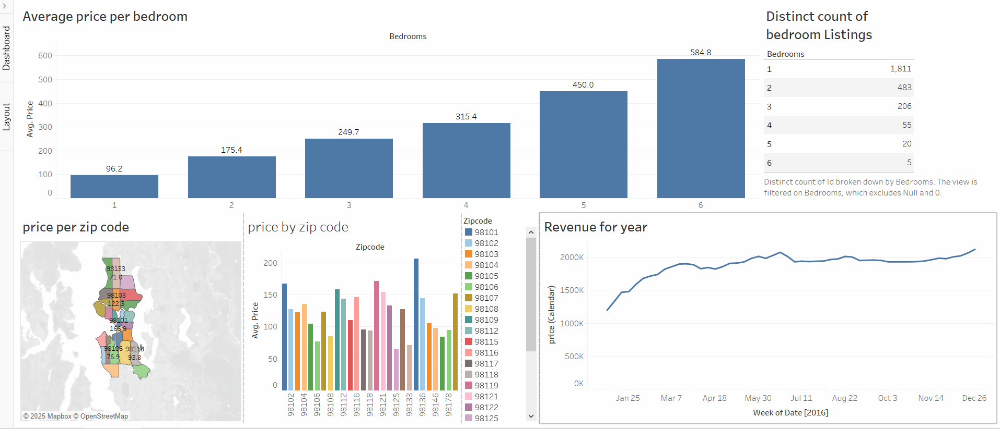

# 🏡 Airbnb Data Analysis – Tableau Dashboard

📊 **[Click here to interact with the live visualization](https://public.tableau.com/views/AirBnBproject_17202696178050/AirBnBDashboard?:language=en-US&:sid=&:redirect=auth&:display_count=n&:origin=viz_share_link)**

## 📌 Project Overview

I used **Tableau** to analyze Airbnb listing data and provide insights into pricing trends, demand distribution, and revenue patterns. The dashboard helps identify how location, number of bedrooms, and other factors influence listing performance.

## 🎯 Objectives

* Explore **average price per bedroom**.
* Compare listing performance across **different zip codes**.
* Track **revenue trends over time**.
* Identify distribution of listings by **number of bedrooms**.
* Build an **interactive dashboard** for better decision-making.

## 🛠️ Tools & Technologies

* **Tableau** (data visualization)
* **Airbnb Dataset** (listings, prices, revenue, location)

## 📊 Dashboard Features

1. **Average Price per Bedroom**

   * Bar chart showing how prices scale with the number of bedrooms.

2. **Listings Distribution by Bedrooms**

   * Table summarizing the distinct count of listings across bedroom sizes.

3. **Price by Zip Code**

   * Choropleth map and bar chart showing average prices across different neighborhoods.

4. **Revenue Trend Over the Year**

   * Line chart tracking revenue patterns throughout 2016.

## ✅ Insights

* Prices increase significantly with the number of bedrooms.
* Certain zip codes (e.g., **98103, 98115, 98133**) have higher average listing prices.
* Revenue peaked mid-year, with slight dips in the later months.
* Single-bedroom listings dominate the market, but multi-bedroom properties generate higher average prices.

## 📂 Dataset Source
* Airbnb listings dataset (publicly available for data visualization projects).
